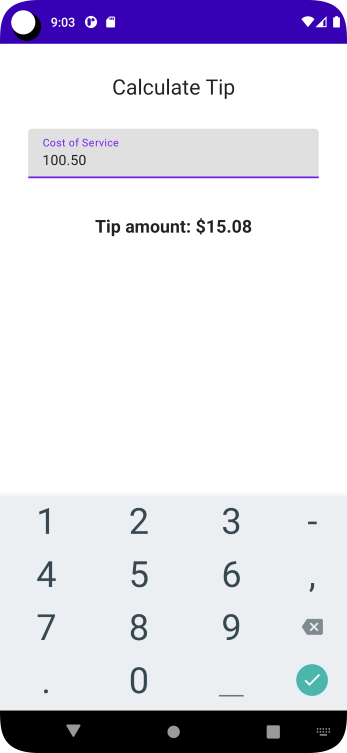
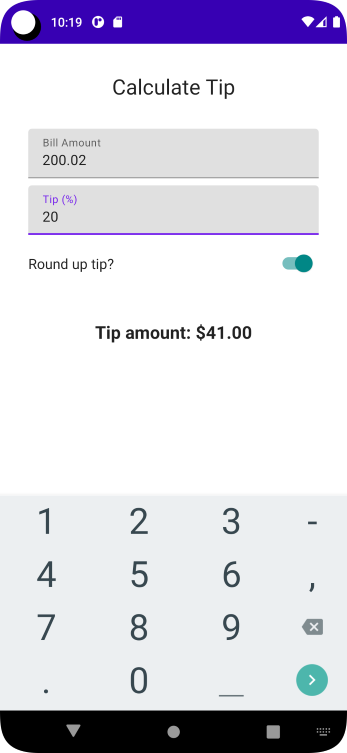

# Tip Time App - Compose

## App Description
Interactive tip calculator that automatically calculates the tip amount when you enter the service amount. 

## Codelab from developer.android
* Codelab : 3) Intro to state in Compose
* Codelab : 4) Calculate a custom tip
* Codelab : 5) Write automated tests

## Solution in github
* Codelab : 3) Branch state  
  https://github.com/google-developer-training/basic-android-kotlin-compose-training-tip-calculator/tree/state
* Codelab : 4) Branch main    
  https://github.com/google-developer-training/basic-android-kotlin-compose-training-tip-calculator/tree/main
* Codelab : 5) Branch test_solution     
  https://github.com/google-developer-training/basic-android-kotlin-compose-training-tip-calculator/tree/test_solution

## Objective
* Use State in a UI. How Compose uses state to display data and How to hoist a state.
* KeyboardActions and keyboardOptions
* Use Switch

## ANDROID BASICS WITH COMPOSE - Unit 2: Building app UI - Pathway 3: UI and State
Link: https://developer.android.com/courses/pathways/android-basics-compose-unit-2-pathway-3

---## Codelab Screenshot
Codelab : 3) Intro to state in Compose  

Codelab : 4) Calculate a custom tip

ref: tip-time-app-android-kotlin-compose
